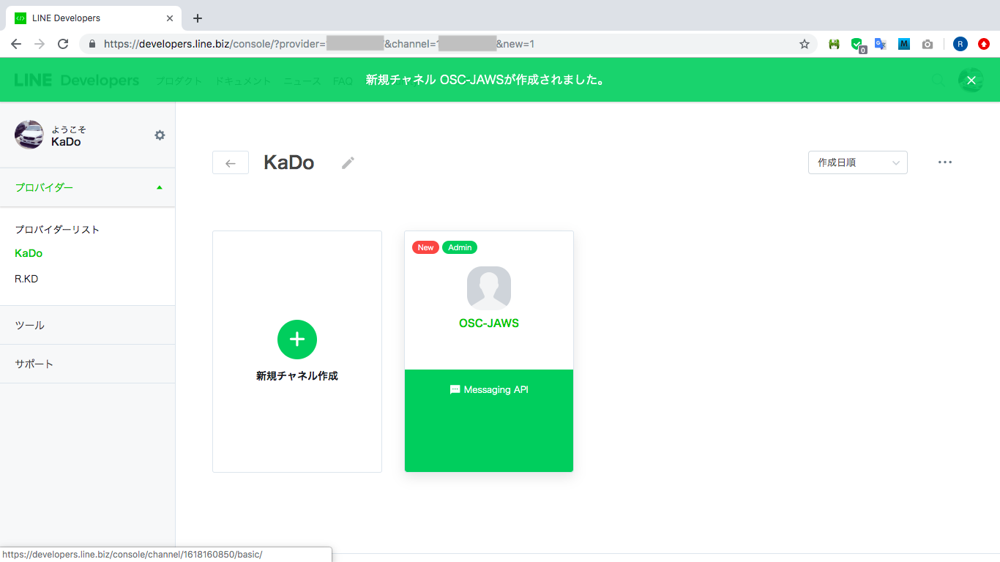
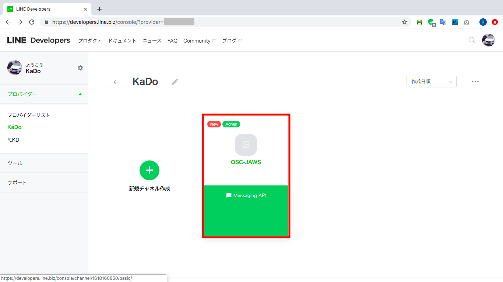

# AWSを使ってLineBotを作ってみる


- メッセージを受信するとLambdaが呼び出される
- Lambdaは「Your message is 送信メッセージ」と返却する

## 応用(今回は触れていません)
- 受信メッセージと返却メッセージをDynamoDBに格納
- 画像を受信した場合にS3に画像を保管
- 受信メッセージを元に何かしらの処理を行う

## ことわり
利用サービスおよびRubyの説明は割愛しています。  
必要でしたら別途説明しますので、遠慮なく質問してください。

# 目的
- 身近なアプリをHackして楽しんでほしい
- サーバレスを体験してほしい
- Cloud9便利ってのを感じてほしい

## 必要なもの
- AWSアカウント
  - 無料枠で完結
- LINEアカウント
  - 無料

## 利用サービス
### AWS
- S3
- Cloud9
- CloudFormation(SAM)
- Lambda
- ApiGateway

### LINE(Developers)
- MessagingApi

## 手順
### 1. LINE Developersにアカウント登録
> LINEアカウントをお持ちの場合は登録がスムーズに進められます。

- [こちらのサイト](https://developers.line.biz/ja/)でアカウント登録を行なってください。

### 2. LINE MessagingApiを登録 (途中)
#### プロバイダー作成

1. [LINEdevelopersプロバイダー一覧](https://developers.line.biz/console/)で「新規プロバイダー作成」をクリックします。


2. プロバイダー名を入力して、「確認する」をクリックします。


3. 「作成する」をクリックします。


4. プロバイダーが作成できます。


#### チャネル作成

1. Messaging APIの「チャネル作成する」をクリックします。


2. 以下の内容を入力して、「入力内容を確認する」をクリックします。

|項目名|入力値|
|---|---|
|アプリ名|OSC-JAWS|
|アプリ説明|LINE bot|
|大業種|個人|
|小業種|個人（その他）|
|メールアドレス|osc-jaws@example.com|


1. 情報利用に関する同意についてが表示されるので、「同意する」をクリックします。


4. 利用規約2箇所にチェックを入れて、「作成」をクリックします。


5. Messaging API用のチャネルが作成できます。



#### チャネル設定 ([参考サイト](https://www.virtual-surfer.com/entry/2018/07/22/190000))
自動応答を無効化していない場合は、Botとして返信することができません。  

1. 使用するチャネルをクリックします。



2. LINE@機能の利用までスクロールして、自動応答メッセージの「設定はこちら」をクリックします。


3. 別タブで応答設定が表示されるので、詳細設定の応答メッセージ:オフを選択して更新します。


#### LINEに友達登録
以下の手順で友達登録用のQRコードが表示されます。  
スマホにインストールされているLINEのQRコードリーダーで友達登録してください。

1. 友達登録するチャネルをクリックします。


2. Bot情報までスクロールして、LINEアプリへのQRコードが確認できます。


### 3. S3バケットを作成
> バケット名を「jaws-osc-kado」としています。  
> 画面右上のリージョンが「**東京**」である必要があります。

1. 「s3」と入力して、サービスを検索します。


2. 「バケットを作成する」をクリックします。


3. バケット名とリージョン(**東京**)を入力して、「作成」をクリックします。


4. バケットが作成できます。


### 4. 開発環境としてCloud9を作成
今回のハンズオンは開発環境をクラウドに作成します。  
> EnviromentNameを「jaws-osc-kado」としています。  
> 画面右上のリージョンが「**東京**」である必要があります。

1. 「cloud9」と入力して、サービスを検索します。


2. 「Create enviroment」をクリックします。


3. Nameを入力して、「Next step」をクリックします。


4. 初期値を変更せずに、「Next step」をクリックします。


5. 確認画面が表示されるので、「Create enviroment」をクリックします。


6. 1分程度待つことで以下のような画面が表示されて開発環境が作成できます。


### 5. Cloud9構築(Ruby2.5, SAM)
元々インストールされているRubyとSAMのバージョンを変更します。  
[こちらのサイト](https://gitkado.hatenadiary.jp/entry/20190701/1561983034)を参考に行なってください。  

### 6. [GitHub](https://github.com/gitkado/jaws-lambda-linebot)からソースを取得
以下のコマンドでソースを取得します。
- 今回必要なファイルになります。
  - function.rb (LineBotが呼び出す処理)
  - Gemfile (開発で必要なライブラリ定義)
  - template.yaml (AWSに自動構築する設計図)

```sh
$ git clone https://github.com/gitkado/jaws-lambda-linebot.git
```

### 7. Gemソース取得
Lambdaで標準以外のGem(ライブラリ)を使用する場合は、GemのソースをLambdaに含める必要があります。  
以下の手順でGemのソースを取得します。

```sh
$ cd jaws-lambda-linebot
$ bundle install
$ bundle install --deployment
```

### 8. template.yamlのENVにLINE MessagingApi情報を追記 (途中)
1. ``「LINE MessagingApiを登録」``で登録したMessagingApiを確認します。


2. template.yamlの **【LINE Developersから取得】** を修正して保存します。

```yaml
# template.yaml(17行目~)
LINE_CHANNEL_ID: 【LINE Developersから取得】
LINE_CHANNEL_SECRET: 【LINE Developersから取得】
LINE_CHANNEL_TOKEN: 【LINE Developersから取得】
```

### 9. SAMコマンド実行
**【バケット名】** は、``「S3バケットを作成」``で作成したバケット名に置き換える必要があります。  
以下のコマンドをそれぞれ実行してLambdaとApiGatewayを作成します。  

```sh
$ sam package \
    --template-file template.yaml \
    --s3-bucket 【バケット名】] \
    --output-template-file packaged-template.yaml \
    --region ap-northeast-1
$ sam deploy \
    --template-file packaged-template.yaml \
    --stack-name cfn-lambda-linebot \
    --capabilities CAPABILITY_IAM
```

### 10. 確認
- 以下のリソースが作成されていることを確認してください。
  - CloudFormation
  - Lambda
  - ApiGateway

### 11. LINEで試す
``「LINE MessagingApiを登録」``でQRコードから登録したLINEアカウントにメッセージを送信して試してみてください。

---

### 参考
[GitHub: LineBotSdk](https://github.com/line/line-bot-sdk-ruby)  
[LINE MessagingApi 利用登録手順](https://jp.fujitsu.com/solutions/cloud/k5/playground/webhandson/preparation/06.html)  
